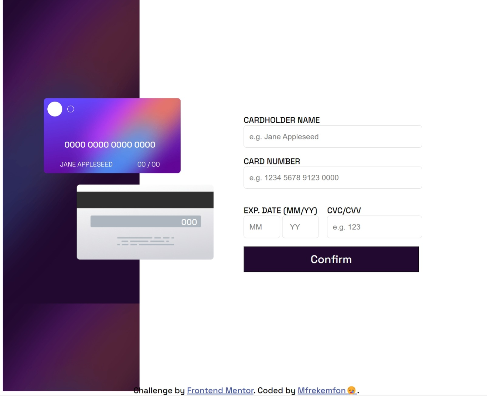
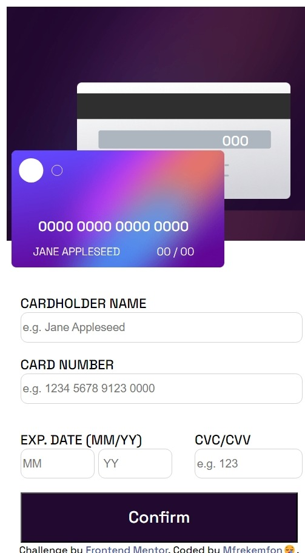
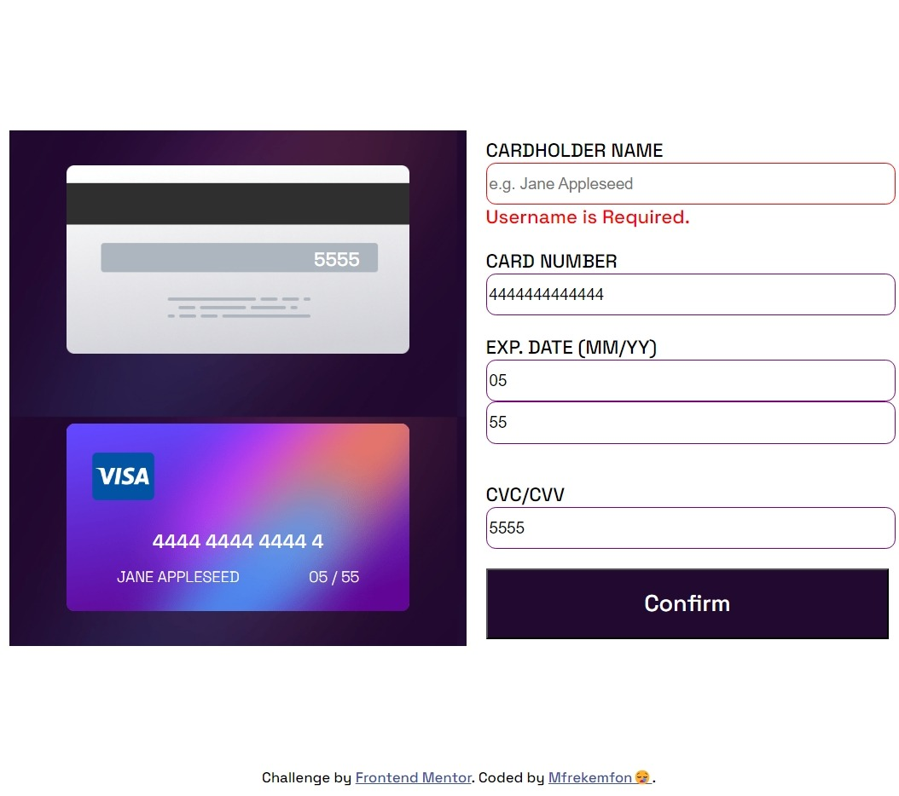
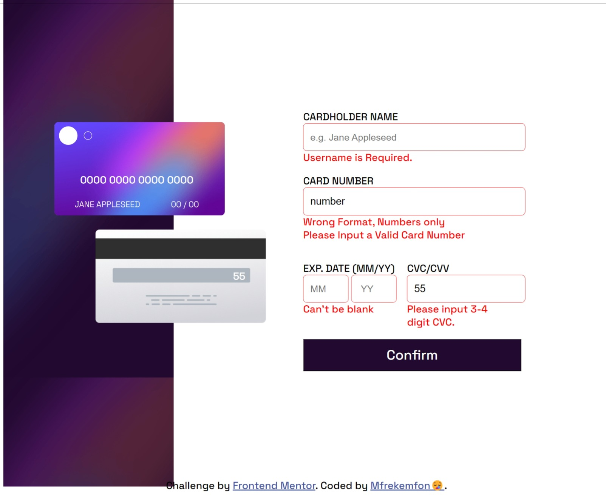

# Frontend Mentor - Interactive card details form solution

This is a solution to the [Interactive card details form challenge on Frontend Mentor](https://www.frontendmentor.io/challenges/interactive-card-details-form-XpS8cKZDWw). Frontend Mentor challenges help you improve your coding skills by building realistic projects. 

## Table of contents

- [Overview](#overview)
  - [The challenge](#the-challenge)
  - [Screenshots](#screenshots)
  - [Links](#links)
- [My process](#my-process)
  - [Built with](#built-with)
  - [What I learned](#what-i-learned)
  - [Continued development](#continued-development)
  - [Useful resources](#useful-resources)
- [Author](#author)

## Overview

### The challenge

Users should be able to:

- Fill in the form and see the card details update in real-time
- Receive error messages when the form is submitted if:
  - Any input field is empty
  - The card number, expiry date, or CVC fields are in the wrong format
- View the optimal layout depending on their device's screen size
- See hover, active, and focus states for interactive elements on the page

### Screenshots

### Links

- Solution URL: https://your-solution-url.com
- Live Site URL: https://animated-selkie-9bbe19.netlify.app/

## My process

### Built with

- Semantic HTML5 markup
- JavaScript Functionalities
- CSS Flexbox

### What I learned

Working on this project, I learnt about and worked with Regular Expressions(RegEx) as well as different form validations. I also learnt more about the different input types and the features of the different CSS transform and position properties.

### Continued development

In the future, when I learn more about APIs, I may be back to this project to add the Stripe API, in order to integrate card payments. 

### Useful resources

- [Isocroft's Credit Card Numbers RegEx](https://gist.github.com/isocroft/072ea5e1f4d0d52eb034e7a6c93b5b76) - This helped me in getting Regular Expressions for the different Credit Card companies.
- [BlackBox AI](https://www.blackbox.ai/) - BlackBox's AI was useful in correcting wrong regular expressions and strengthening the form input validations.

## Author

- Frontend Mentor - [@Mfrekee](https://www.frontendmentor.io/profile/Mfrekee)
- Twitter - [@acmfrekemfon](https://www.twitter.com/acmfrekemfon)

